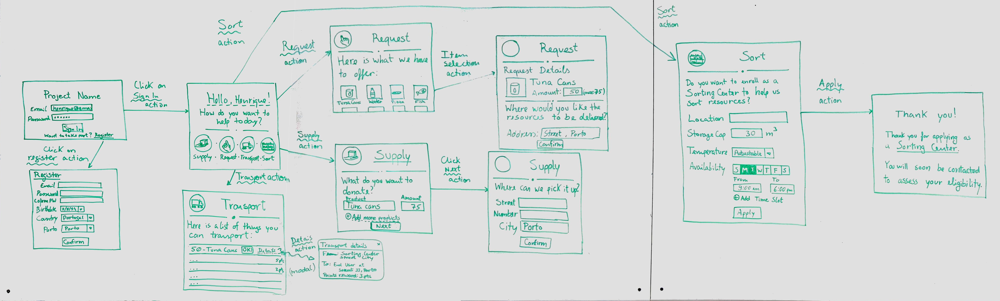
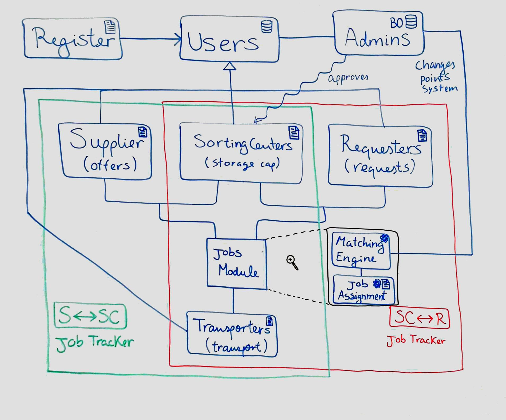
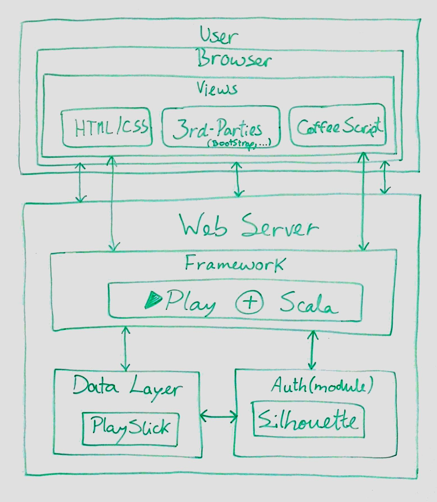

# FEUP - LDSO

## Useful links

[Pivotal Tracker](https://www.pivotaltracker.com/n/projects/1440740)

[Project Slide Deck](https://docs.google.com/presentation/d/1tpRTZxRhZanBhGaZbQzGqQNrXN6ymMWVaS-mzY5ajIE/edit?usp=sharing)

[Up-to-date work progress reports](https://docs.google.com/document/d/13SErd2FBhMll8BoVcyBczqyJi5gbfSb6gMcUERPVN90)

[Product Owner details and log reports](https://docs.google.com/document/d/12Pt-ptbzfypwF76mVlNtiV2sRTehlALwn6Sxi7XKYIU/edit?usp=sharing)

[Scrum Masters Slack - for Scrum Master only](https://sereno-team.slack.com)

## Project mock-ups

## Logical and Technological Architectures

## Iteration 0 - User Stories
https://docs.google.com/document/d/1Gvz6hV7IL-S0Di_gth0wB3kfemIyGqVl-HGEiVFWHw0
